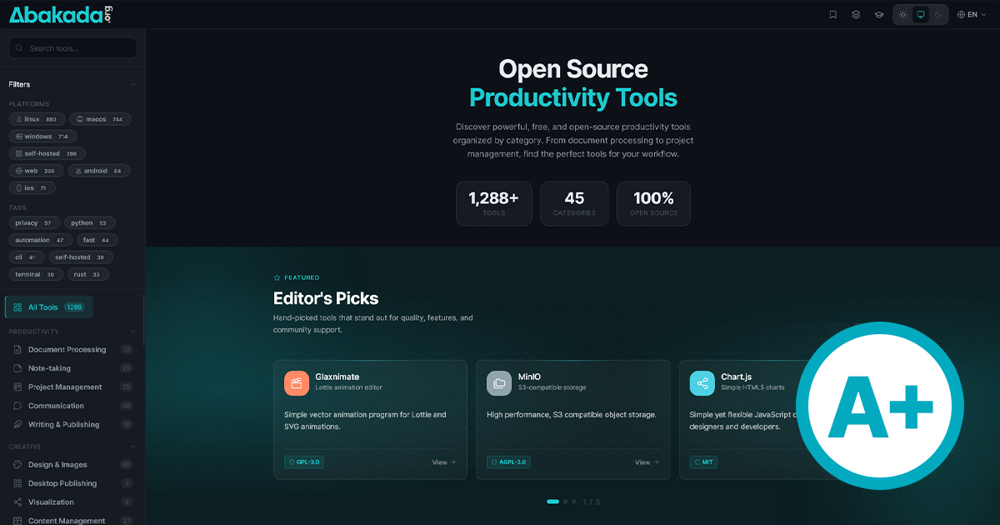

<div align="center">
  

  <h1>Abakada.org</h1>

  <p>A curated, multilingual directory of 1,288 free and open-source productivity tools<br/>for Filipino students, educators, scholars, and professionals.</p>

  <p>
    <a href="https://www.gmanetwork.com/news/pinoyabroad/dispatch/989216/ofw-developersoftware-hub-filipino-students/story/"></a>
    <a href="https://theglobalfilipinomagazine.com/the-advocate-behind-a-growing-free-tech-movement-in-philippine-education/"></a>
    <a href="https://walastech.com/news/abakada-org-wants-to-close-the-software-gap-in-philippine-schools/"></a>
    <a href="https://tuguegarao.bomboradyo.com/ofw-developer-naglunsad-ng-libreng-software-hub-para-sa-mga-estudyanteng-pilipino/"></a>
  </p>

  <p>
    <a href="https://abakada.org"></a>
    <a href="mailto:hello@abakada.org"></a>
    <a href="LICENSE.md"></a>
    
    
    
  </p>

  <p>
    Built as a Progressive Web App with offline support, four Philippine languages,<br/>
    static-site prerendering, and zero backend dependencies.
  </p>
</div>

---

## Table of Contents

- [Overview](#overview)
- [Tech Stack](#tech-stack)
- [Features](#features)
- [Pages & Routing](#pages--routing)
- [Localization (i18n)](#localization-i18n)
- [SEO, AEO & GEO](#seo-aeo--geo)
- [Performance](#performance)
- [Project Architecture](#project-architecture)
- [Getting Started](#getting-started)
- [Development Workflow](#development-workflow)
- [Production Build](#production-build)
- [Deployment](#deployment)
- [Configuration](#configuration)
- [GitHub Actions](#github-actions)
- [Browser Support](#browser-support)
- [Author](#author)
- [License](#license)
- [Contributing](#contributing)
- [Security](#security)

---

## Overview

Abakada.org is a static, hand-curated catalog of free and open-source software for Filipino learners. Every tool is manually verified for licensing, safety, and educational value. The site is a fully prerendered React Progressive Web App that ships as a folder of static files — no backend, no database, no user accounts, no telemetry.

| Metric | Value |
|:---|:---|
| Tools | 1,288 (manually curated) |
| Categories | 45+ |
| Learning paths | 10 |
| Languages | 4 (English, Tagalog, Ilokano, Bisaya) |
| Prerendered HTML routes | 1,309 (11 static pages + 10 toolkits + 1,288 tools) |
| Backend | None |
| User accounts | None |
| Tracking | None (Google Analytics is the only signal, anonymized IP) |

---

## Tech Stack

<table>
  <tr>
    <td align="center" width="110">
      <br/>
      <sub><b>React 18</b></sub>
    </td>
    <td align="center" width="110">
      <br/>
      <sub><b>Vite</b></sub>
    </td>
    <td align="center" width="110">
      <br/>
      <sub><b>JavaScript ESM</b></sub>
    </td>
    <td align="center" width="110">
      <br/>
      <sub><b>CSS3</b></sub>
    </td>
    <td align="center" width="110">
      <br/>
      <sub><b>HTML5</b></sub>
    </td>
    <td align="center" width="110">
      <br/>
      <sub><b>Node.js</b></sub>
    </td>
    <td align="center" width="110">
      <br/>
      <sub><b>Apache / cPanel</b></sub>
    </td>
    <td align="center" width="110">
      <br/>
      <sub><b>Git</b></sub>
    </td>
    <td align="center" width="110">
      <br/>
      <sub><b>GitHub</b></sub>
    </td>
  </tr>
</table>

**Core dependencies**

| Package | Purpose |
|:---|:---|
| `react`, `react-dom` | UI framework |
| `react-router-dom` | Client-side routing with language-prefixed routes |
| `react-helmet-async` | Per-page `<head>` management for SEO |
| `vite`, `@vitejs/plugin-react` | Build tool, dev server, JSX transform |

> No backend. No database. No external API calls at runtime. All catalog data is served from static JSON files.

---

## Features

<details open>
<summary><b>Tool Directory</b></summary>
<br/>

- 1,288 free and open-source tools across 45+ categories
- Category-based filtering with sidebar navigation
- Full-text search with debounce and result highlighting
- Platform filters (Linux, macOS, Windows, Web, Android, iOS, self-hosted)
- Tag filters (privacy, python, automation, fast, CLI, terminal, rust, …)
- Per-tool detail page (`/tools/:id`) with FAQ schema, related tools, and JSON-LD `SoftwareApplication`
- Featured Editor's Picks carousel on the home page

</details>

<details>
<summary><b>Learning Paths</b></summary>
<br/>

- 10 curated learning paths organized by role and goal:
  - Digital Foundations · Research Starter · Student Productivity · Teacher's Digital Classroom · Remote Team Collaboration · Workplace Productivity · Self-Directed Learner · Beginner Coding · Designer's Toolkit · Accountant's Essentials
- Onboarding modal on first visit prompts the user to choose a role (9 personas: Student, Educator, Professional, Self-Directed, New to Digital, Researcher, Developer, Designer, Accountant)
- Progress tracking persisted in `localStorage` — no account required
- Dedicated detail page per toolkit with stage-based accordion structure
- Hands-on task checklists per stage, persisted in `localStorage`
- Curriculum alignment section: DepEd K-12 and CHED framework tags displayed per toolkit
- `<CompletionCertificate />` component unlocked at 100% progress — printable/PDF-saveable
- Full i18n coverage: all UI strings in LearningPaths, LearningPathDetail, CompletionCertificate and the OnboardingModal are wired through `t()` across all four languages
- JSON-LD `Course` structured data per toolkit

</details>

<details>
<summary><b>Bookmarks</b></summary>
<br/>

- Save tools to a personal list, persisted entirely in `localStorage`
- Counter badge in header and mobile sidebar
- Dedicated `/bookmarks` page with full tool cards
- Background sync via IndexedDB queue when offline

</details>

<details>
<summary><b>Tool Comparison</b></summary>
<br/>

- Side-by-side comparison of up to 4 tools
- Counter badge in header and mobile sidebar
- Dedicated `/compare` page with structured attribute table
- Selection persists across navigation in `localStorage`

</details>

<details>
<summary><b>Glossary</b></summary>
<br/>

- 31 entries grouped into 10 thematic sections (Open-Source Licensing, Web Architecture, Search Visibility, Structured Data, Performance Metrics, Crawler Standards, AI, Software Properties, Audience & Localization, Educational Open Resources)
- Same legal-page layout pattern as Privacy Policy and Terms of Use for visual consistency
- JSON-LD `DefinedTermSet` for direct entity recognition
- Per-term anchor IDs for citation linking
- Localized intro and attribution sections in all four languages

</details>

<details>
<summary><b>Legal Pages</b></summary>
<br/>

- **Privacy Policy** (`/privacy`) — 9 sections covering data collection, cookies, third-party links, security, and user rights
- **Terms of Use** (`/terms`) — 17 enterprise-grade sections including:
  - Intellectual Property Rights and Abakada Marks
  - Acceptable Use Policy
  - Brand and Reputation Protection
  - Limitation of Liability (₱100 cap)
  - Indemnification
  - Governing Law (Republic of the Philippines)
- Both pages share the `legal-content` layout system for unified visual hierarchy

</details>

<details>
<summary><b>Partnerships</b></summary>
<br/>

- **Partnerships page** (`/partnerships`) — three equal-weight partnership tiers, fully synced with the deck:
  - Community Supporter — for NGOs, schools, student organizations
  - Content & Editorial Partner — for educators, publishers, FOSS projects
  - Infrastructure Sponsor — for hosting/financial sponsors
- All three tiers rendered with identical visual weight — no "Recommended" badge or highlight on any tier
- Includes the same impact stats shown in the deck (1,288 tools · 45+ categories · 10 paths · 4 languages)
- **Partnership Deck** (`/partnership-deck`) — 10-slide scroll-snap presentation with reveal-on-scroll animation, shared visual language and identical email CTA (`partnerships@abakada.org`) with the partnerships page; tier cards are visually equal with no featured/recommended callout
- **Download Pitch Deck** — dedicated download button on the CTA slide (slide 10) allowing users to directly download `Abakada-Pitch-Deck-2026.pdf` from `/assets/doc/`

</details>

<details>
<summary><b>Progressive Web App (PWA)</b></summary>
<br/>

- Service Worker with cache-first, network-first, and stale-while-revalidate strategies
- Full offline support with custom offline fallback page
- App-shell pre-cache on install
- Background sync for bookmark operations via IndexedDB queue
- Install banner with platform-aware UX:
  - iOS Safari: explicit "Tap Share → Add to Home Screen" instructions
  - Android / Desktop Chrome / Edge: native `beforeinstallprompt` flow
- SW update notification banner — only on genuine updates, not first install
- Web App Manifest with shortcuts, icons, and screenshots

</details>

<details>
<summary><b>Internationalization (i18n)</b></summary>
<br/>

- 4 languages: English, Filipino (Tagalog), Ilokano, Bisaya (Cebuano)
- Language switcher in header
- URL-prefixed routes per language (`/`, `/tl`, `/ilo`, `/bis`, `/en`)
- Translation files stored at `public/assets/data/translations/{en,tl,ilo,bis}.json`
- 620+ translation keys per language with full key parity across all four files
- Complete Learning Paths module i18n: all UI strings in `LearningPaths.jsx`, `LearningPathDetail.jsx`, `CompletionCertificate.jsx`, and `OnboardingModal.jsx` wired through `t()` — no hardcoded English strings remain in the module
- New `learningPaths.*` keys include: difficulty labels, stats row, filter UI (tracks, levels, curriculum strands), DepEd/CHED authority labels, progress ring, stage body section headings, milestone messages, motivational nudge, certificate strings, and all 9 onboarding role labels
- `<html lang>` attribute syncs on language change (BIS maps to BCP-47 `ceb`)
- Native authoring — no machine translation
- Smooth opacity transition on language change

</details>

<details>
<summary><b>Theming</b></summary>
<br/>

- Light, dark, and system modes with auto-detection
- Manual override persisted in `localStorage`
- Smooth theme transition via CSS class
- Design token system via CSS custom properties (colors, spacing, radius, shadows, typography)
- Dot-grid backgrounds, glass-edge cards, layered depth

</details>

<details>
<summary><b>Loading Experience</b></summary>
<br/>

- Inline boot loader in `index.html` — glowing favicon with halo animation that renders before the JS bundle parses, automatically replaced by React on mount
- `<BrandLoader />` component with three variants (`block`, `inline`, `page`) used across:
  - React Suspense fallback for lazy routes
  - Initial `tools.json` fetch
  - Learning Paths and Learning Path Detail loading
- Theme-aware boot screen (auto-switches to dark background under `prefers-color-scheme: dark`)
- Respects `prefers-reduced-motion: reduce` — animation disabled, mark stays static
- All "Loading…" plain-text fallbacks have been removed in favor of the brand loader

</details>

<details>
<summary><b>Accessibility</b></summary>
<br/>

- Skip-to-main-content link
- ARIA roles, labels, and live regions throughout
- Focus-visible outlines on all interactive elements
- Semantic HTML (`<main>`, `<nav>`, `<article>`, `<section>`, `<dl>`, `<time>`)
- `prefers-reduced-motion` and `prefers-contrast: high` honored

</details>

<details>
<summary><b>Footer & Navigation</b></summary>
<br/>

- **Quick Links** column: All Tools · Bookmarks · Comparison Tools · Learning Paths · top categories
- **Resources** column: FAQ · Glossary · Contribute on GitHub · Open Source Initiative · Partnership Pitch Deck (direct PDF download) · Privacy Policy · Terms of Use · Sitemap
- **Abakada** column: About · Official Partners · Partnerships · Contact
- **Featured In** strip: full-width press/media section below the column grid with theme-aware logo variants for GMA News Online, The Global Filipino Magazine, Walastech, and Bombo Radyo — each an external link (`target="_blank" rel="noopener noreferrer"`)
- All link labels translated across en/tl/ilo/bis
- Visitor count pill — improved contrast (medium font weight, accent-tinted icon, subtle filled background) showing total visitors and last update from `visitors.json`
- Header language switcher includes BIS, ILO, TL, EN with native and BCP-47 `<html lang>` mapping
- Learning Paths header icon adopts accent color when the current route is `/learning-paths` or any sub-path, using `useLocation` + `stripLangPrefix` for language-prefix-aware route matching; `aria-current="section"` set for screen readers

</details>

<details>
<summary><b>Security</b></summary>
<br/>

- Strict Content Security Policy across `index.html`, `public/.htaccess`, `public/_headers`, and `vercel.json`
- Security headers: `Strict-Transport-Security`, `X-Frame-Options: DENY`, `X-Content-Type-Options: nosniff`, `Referrer-Policy`, `Permissions-Policy`, `Cross-Origin-Opener-Policy`, `Cross-Origin-Resource-Policy`
- Console warning, context-menu disable, and selection disable on tool card content
- Passive bot signal collection (dev-only logging)
- Email obfuscation utility
- AI-scraper rules in `robots.txt` (GPTBot, CCBot, Claude-Web, etc.)

</details>

---

## Pages & Routing

All routes are prerendered at build time and lazy-loaded via `React.lazy`. Each route also serves under language prefixes (`/tl`, `/ilo`, `/bis`, `/en`).

| Route | Description | Sidebar |
|:---|:---|:---:|
| `/` | Home — directory with search, filters, featured carousel | Inline filter sidebar |
| `/tools/:id` | Per-tool detail page with FAQ, related tools, structured data | — |
| `/learning-paths` | Learning path index | Collapsed |
| `/learning-paths/:id` | Individual learning path detail | Collapsed |
| `/bookmarks` | Saved tools | Collapsed |
| `/compare` | Compare up to 4 tools | Collapsed |
| `/glossary` | 31-entry glossary in 10 sections | Collapsed |
| `/about` | About Abakada | Collapsed |
| `/contact` | Contact page | Collapsed |
| `/faq` | Frequently Asked Questions | Collapsed |
| `/privacy` | Privacy Policy | Collapsed |
| `/terms` | Terms of Use | Collapsed |
| `/partnerships` | Partnership tiers and stats | Collapsed |
| `/partnership-deck` | 10-slide presentation | Hidden |
| `/official-partners` | Official partner logos — BetterGov PH, Vaultera Labs, ElevenLabs | Collapsed |
| `/sitemap` | HTML sitemap covering all 1,309 routes | Collapsed |

> The `<html lang>` attribute, `og:locale`, and `hreflang` alternates update automatically per route and language.

---

## Localization (i18n)

```
public/assets/data/translations/
├── en.json    English
├── tl.json    Filipino / Tagalog
├── ilo.json   Ilokano
└── bis.json   Bisaya / Cebuano (BCP-47: ceb)
```

- **620+ keys per language** with verified parity across all four files
- Top-level groups: `meta`, `nav`, `hero`, `groups`, `categories`, `tools`, `featured`, `platforms`, `search`, `filters`, `pagination`, `theme`, `footer`, `accessibility`, `common`, `health`, `license`, `time`, `pages`, `pwa`, `bookmark`, `compare`, `learningPaths`, `onboarding`, `cta`, `breadcrumb`, `errors`, `glossary`, `deck`, `bookmarks`
- Dynamic-prefix lookups: `groups.${id}`, `categories.${id}`, `learningPaths.role.${id}`, `learningPaths.${difficulty}`
- Translations are authored editorially per language — no machine translation
- Adding a new key requires updating all four files; CI verifies parity at build time

**Language detection priority:**
1. URL prefix (`/tl/...`)
2. `localStorage` (`abakada-language`)
3. `navigator.language` (`tl`/`fil` → tl, `ilo` → ilo, `ceb`/`bis` → bis)
4. Default: `en`

---

## SEO, AEO & GEO

The site is built for traditional search engines (SEO), generative answer engines (GEO — ChatGPT, Perplexity, Bing Copilot, Google AI Overviews), and direct-answer surfaces (AEO — featured snippets, knowledge panels).

**Per-page `<head>` management** via `react-helmet-async` and a centralized `pageMeta` config:

- Page-specific `<title>` and meta description (≤ 60 chars / ≤ 160 chars)
- Open Graph and Twitter Card tags with locale-correct `og:locale`
- Canonical URLs and hreflang alternates per language (`en`, `tl`, `ilo`, `ceb`, `x-default`)
- Robots directives (`index, follow, max-snippet:-1, max-image-preview:large`)

**Structured data (JSON-LD)** — the catalog ships these schema.org types:

| Type | Where |
|:---|:---|
| `WebSite` + `SearchAction` | Site root |
| `Organization` | Site root |
| `EducationalOrganization` | Site root, with founder Person |
| `WebPage` | Home |
| `ItemList` | Home (top categories), Learning Paths |
| `BreadcrumbList` | Every page |
| `FAQPage` | FAQ + per-tool pages |
| `Course` | Each learning path |
| `SoftwareApplication` + `Review` + `Offer` | Each tool detail page |
| `DefinedTermSet` + `DefinedTerm` | Glossary |
| `AboutPage` | About |
| `ContactPage` | Contact |

**Crawler-aware delivery:**

- `sitemap.xml` regenerated on every build via `scripts/refresh-sitemap.js`
  - 1,309 URLs total: 11 static + 10 toolkits + 1,288 tools
  - Each URL carries hreflang alternates for all four languages
  - Image sitemap entry on the home route
- `llms.txt` published at the site root summarizing site purpose and key URLs
- `robots.txt` with per-bot rules — search retrievers allowed, training crawlers (GPTBot, CCBot, Claude-Web) blocked
- `scripts/prerender-shells.js` writes a static HTML shell per route after build, so first-byte already contains the correct title, description, canonical, and OG tags before JS executes

---

## Performance

| Optimization | Details |
|:---|:---|
| Code splitting | All pages lazy-loaded via `React.lazy` + `Suspense` |
| Vendor chunk | React, React Router, Helmet split into a long-lived cached bundle |
| Content-hash filenames | `entry-[hash].js`, `chunk-[hash].js`, `asset-[hash].ext` for `Cache-Control: max-age=31536000, immutable` |
| Inline boot loader | Glowing favicon SVG inside `#root`, renders before JS parses, replaced by React on mount |
| `tools.json` preload | `<link rel="preload" as="fetch" type="application/json" crossorigin>` so the 1.1 MB catalog downloads in parallel with JS |
| Font preloads | All 4 Inter weights as `font/woff2` with `crossorigin` |
| DNS prefetch + preconnect | Google Tag Manager, Google Analytics |
| Service Worker | App-shell precache + runtime cache strategies |
| Static prerendering | 1,309 HTML shells written by `scripts/prerender-shells.js` |
| Image hints | `loading="lazy"` + `decoding="async"` on below-the-fold images; `fetchpriority="high"` on the header logo |
| Minification | esbuild, ES2020 target, sourcemaps off in production |
| Compression | Gzip + Brotli via `.htaccess` and `_headers` |
| Cache headers | `/assets/*` immutable for 1 year; HTML revalidates on every request |
| Web Vitals | `reportWebVitals()` instruments LCP, CLS, INP for monitoring |

**Bundle footprint (gzipped, latest build):**

| Chunk | Size |
|:---|---:|
| `vendor` (React + Router + Helmet) | 59.9 KB |
| CSS (full design system) | 26.0 KB |
| App entry (`index`) | 16.4 KB |
| `PartnershipDeck` | 11.1 KB |
| `LearningPathDetail` | 6.8 KB |
| `LearningPaths` | 4.5 KB |
| Average page chunk | < 4 KB |
| Total build time | ~2.1 s |

---

## Project Architecture

```
abakada.org/
├── public/
│   ├── assets/
│   │   ├── data/
│   │   │   ├── tools.json                # All tool data (1,288 entries)
│   │   │   ├── learning-paths.json       # 10 toolkits with stages
│   │   │   ├── curriculum.json           # DepEd K-12 and CHED strand definitions
│   │   │   ├── visitors.json             # Updated nightly via GitHub Action
│   │   │   └── translations/             # i18n JSON files (en, tl, ilo, bis)
│   │   ├── doc/                          # Downloadable documents (Pitch Deck PDF)
│   │   ├── fonts/                        # Self-hosted Inter woff2 files
│   │   ├── logo/                         # Favicons, OG image, brand logos
│   │   ├── partner/                      # Official partner logos (light + dark variants)
│   │   │                                 # BetterGov PH · Vaultera Labs · ElevenLabs
│   │   └── press/                        # Press / media logos (light + dark variants)
│   │                                     # GMA News Online · The Global Filipino Magazine
│   │                                     # Walastech · Bombo Radyo
│   ├── .htaccess                         # Apache: SPA routing, headers, gzip, cache
│   ├── _headers                          # Netlify / Cloudflare Pages headers
│   ├── llms.txt                          # LLM-ingestion summary
│   ├── offline.html                      # Offline fallback page
│   ├── robots.txt                        # Per-bot rules incl. AI scraper blocks
│   ├── sitemap.xml                       # Generated at build time
│   ├── site.webmanifest                  # PWA manifest
│   └── sw.js                             # Service Worker
├── scripts/
│   ├── refresh-sitemap.js                # Regenerates sitemap.xml from data
│   └── prerender-shells.js               # Writes 1,309 static HTML shells
├── src/
│   ├── components/
│   │   ├── BrandLoader.jsx               # Glowing-favicon loading indicator
│   │   ├── CompletionCertificate.jsx     # Printable/PDF certificate, unlocked at 100% LP progress
│   │   ├── ErrorBoundary.jsx
│   │   ├── FeaturedCarousel.jsx
│   │   ├── Footer.jsx                    # Includes "Featured In" press strip + PRESS data
│   │   ├── Header.jsx                    # Active-state accent on LP icon via useLocation
│   │   ├── Icon.jsx
│   │   ├── LearningToolCard.jsx
│   │   ├── OnboardingModal.jsx
│   │   ├── Pagination.jsx
│   │   ├── PWAInstallBanner.jsx
│   │   ├── SearchInput.jsx
│   │   ├── SEO.jsx                       # react-helmet-async wrapper
│   │   ├── Sidebar.jsx
│   │   ├── StaticPageLayout.jsx
│   │   ├── ToolCard.jsx
│   │   └── ToolModal.jsx
│   ├── contexts/
│   │   ├── BookmarkContext.jsx
│   │   ├── ComparisonContext.jsx
│   │   ├── I18nContext.jsx               # Language detection, URL routing, translations
│   │   └── ThemeContext.jsx
│   ├── hooks/
│   │   ├── useComparison.js
│   │   ├── useLowBandwidth.js
│   │   ├── useProgress.js
│   │   ├── usePWAInstall.js
│   │   └── useSearch.js
│   ├── lib/
│   │   ├── canonical.js                  # SITE_ORIGIN, hreflang, language helpers
│   │   ├── comparison.js
│   │   ├── downloadFile.js
│   │   ├── icons.js
│   │   ├── pageMeta.js                   # Per-page <head> metadata
│   │   ├── reportError.js                # Production error reporter (POST to VITE_ERROR_REPORT_URL)
│   │   ├── security.js
│   │   └── vitals.js                     # Core Web Vitals reporter
│   ├── pages/
│   │   ├── About.jsx
│   │   ├── Bookmarks.jsx
│   │   ├── Compare.jsx
│   │   ├── Contact.jsx
│   │   ├── FAQ.jsx
│   │   ├── Glossary.jsx
│   │   ├── Home.jsx
│   │   ├── LearningPathDetail.jsx
│   │   ├── LearningPaths.jsx
│   │   ├── NotFound.jsx
│   │   ├── OfficialPartners.jsx
│   │   ├── Partnerships.jsx
│   │   ├── PartnershipDeck.jsx
│   │   ├── Privacy.jsx
│   │   ├── Sitemap.jsx
│   │   ├── Terms.jsx
│   │   └── ToolDetail.jsx
│   ├── styles/
│   │   ├── animations.css                # Keyframes + BrandLoader animation
│   │   ├── base.css                      # Resets, typography
│   │   ├── components.css                # Per-component styles
│   │   ├── inter.css                     # Self-hosted font face
│   │   ├── layout.css                    # Grid, header, footer, sidebar layouts
│   │   └── themes.css                    # Light / dark CSS custom properties
│   ├── App.jsx                           # Routes, lazy loading, language-aware route checks
│   └── main.jsx                          # Entry point + service worker registration
├── .github/
│   └── workflows/
│       ├── update-visitors.yml           # Nightly visitor count from GA4 Data API
│       ├── fetch-visitors.yml            # On-demand variant
│       ├── lighthouse.yml                # Lighthouse CI on PRs
│       └── sitemap-refresh.yml           # Scheduled sitemap regeneration
├── .lighthouserc.json                    # Lighthouse CI config
├── index.html                            # Inline boot loader + SEO meta
├── vercel.json                           # SPA rewrites + security headers
├── vite.config.js                        # Vendor split, content hashing, ES2020 target
└── package.json
```

---

## Getting Started

### Prerequisites

- Node.js 18 or higher
- npm 9 or higher

### Installation

```bash
git clone https://github.com/Abakada-org/abakada.org.git
cd abakada.org
npm install
```

### Run the dev server

```bash
npm run dev
```

Opens at `http://localhost:5173`. HMR is enabled — file changes apply instantly.

---

## Development Workflow

### Branching

- `main` — production; auto-deployed
- Feature branches use the pattern `feat/<short-description>`
- Bugfix branches use `fix/<short-description>`

### Common scripts

```bash
npm run dev         # Vite dev server with HMR
npm run sitemap     # Regenerate public/sitemap.xml from data
npm run build       # Production build (runs prebuild + build + postbuild)
npm run preview     # Preview the production bundle locally
npm run lint        # ESLint over src/
```

The `build` lifecycle runs:

1. `prebuild` → `node scripts/refresh-sitemap.js` regenerates `public/sitemap.xml`
2. `build` → `vite build` produces `dist/`
3. `postbuild` → `node scripts/prerender-shells.js` writes 1,309 static HTML shells

### Working with translations

1. Add the new key to `public/assets/data/translations/en.json`
2. Add corresponding keys to `tl.json`, `ilo.json`, `bis.json`
3. Use it in JSX via `useI18n()`:
   ```jsx
   const { t } = useI18n()
   t('section.key', 'English fallback')
   ```
4. The fallback string serves as the source of truth if the key is missing

### Adding a new page

1. Create the component in `src/pages/`
2. Add a `lazy()` import and `<Route>` in `src/App.jsx`
3. Add metadata to `src/lib/pageMeta.js`
4. Add the path to `STATIC_SIDEBAR_PATHS` in `App.jsx` if it should use the collapsible sidebar
5. Add the path to `scripts/refresh-sitemap.js` and `scripts/prerender-shells.js`
6. Add corresponding translation keys to all four language files
7. Add a footer / sidebar link if the page should be discoverable

---

## Production Build

```bash
npm run build
```

Produces a fully static `dist/` containing:

- `dist/index.html` — root SPA shell (with inline boot loader)
- `dist/<route>/index.html` — 1,308 prerendered route shells
- `dist/assets/*.js` — content-hashed JS chunks
- `dist/assets/*.css` — content-hashed CSS bundles
- `dist/assets/data/*` — JSON catalog and translations
- `dist/assets/fonts/*` — self-hosted Inter
- `dist/assets/logo/*` — brand assets
- `dist/sitemap.xml`, `dist/robots.txt`, `dist/llms.txt`, `dist/sw.js`, `dist/offline.html`, `dist/site.webmanifest`, `dist/.htaccess`, `dist/_headers`

Deploy the `dist/` folder verbatim — every file in it is intended to be uploaded.

---

## Deployment

### cPanel / Shared Hosting (Apache)

1. Run `npm run build` locally
2. Upload the entire contents of `dist/` to your `public_html/` directory
3. In cPanel File Manager, enable **Show Hidden Files** to confirm `.htaccess` is present
4. The `.htaccess` handles SPA routing, security headers, gzip, and cache control

The repository ships an hourly GitHub Action that pulls the live GA4 visitor total and FTPS-uploads `visitors.json` directly to cPanel — see `.github/workflows/fetch-visitors.yml`. The file is stripped from `dist/` during `postbuild` so manual deploys never overwrite the workflow's freshly-fetched value.

> **Deploy path note (production):** On the canonical `abakada.org` host the FTP account lands in the account home and the document root is the **`abakada.org/`** folder, so both workflows use `server-dir: abakada.org/…`. It is *not* `public_html/` on this host — repointing the workflows at `public_html/` uploads to an unserved sibling directory and the file 404s. Both workflows now run a post-deploy liveness check that fails the build if the uploaded file is not reachable at its public URL.

### Vercel

Push to your connected GitHub repository. `vercel.json` handles SPA rewrites and security headers automatically.

### Netlify / Cloudflare Pages

`public/_headers` handles security headers. Configure SPA redirects to `/index.html`:

```
/*  /index.html  200
```

### Service Worker cache version

Bump the cache identifier in `public/sw.js` before each release so returning users receive fresh assets:

```js
const CACHE_NAME = 'abakada-vN' // increment per deploy
```

---

## Configuration

### Adding or updating tools

Edit `public/assets/data/tools.json`. Each entry:

```json
{
  "id": "unique-tool-id",
  "name": "Tool Name",
  "tagline": "Short one-line description",
  "description": "Full description",
  "category": "category-slug",
  "platforms": ["Windows", "macOS", "Linux", "Web"],
  "license": "MIT",
  "tags": ["tag1", "tag2"],
  "url": "https://tool-website.com",
  "download_url": "https://tool-website.com/download",
  "lastReviewed": "2026-05-09",
  "featured": false
}
```

### Updating learning paths

Edit `public/assets/data/learning-paths.json`. Each toolkit references tool IDs by their `id` in `tools.json`.

### Updating page metadata

Edit `src/lib/pageMeta.js`. Each page exports a config object consumed by `<SEO />`:

```js
home: {
  title: 'Page Title',
  description: '≤ 160 chars',
  pathname: '/',
  jsonLd: breadcrumb([{ name: 'Home', path: '/' }])
}
```

---

## GitHub Actions

| Workflow | Trigger | Purpose |
|:---|:---|:---|
| `fetch-visitors.yml` | `schedule` (hourly) + manual | Pulls the cumulative `totalUsers` from the GA4 Data API into `public/assets/data/visitors.json`, commits with `[skip ci]`, and deploys the file to cPanel via FTPS. Skips commit/deploy when the value is unchanged. |
| `lighthouse.yml` | `pull_request` | Runs Lighthouse CI against the preview URL |
| `sitemap-refresh.yml` | `schedule` | Regenerates `sitemap.xml` against current data |

Required repository secrets:

| Secret | Used by |
|:---|:---|
| `GA4_SERVICE_ACCOUNT_KEY` (full JSON key) | `fetch-visitors.yml` — GA4 Data API access |
| `CPANEL_FTP_HOST`, `CPANEL_FTP_USER`, `CPANEL_FTP_PASS` | `fetch-visitors.yml` — FTPS upload to cPanel |

---

## Browser Support

| Browser | Support |
|:---|:---:|
| Chrome / Edge 90+ | Full |
| Firefox 90+ | Full |
| Safari 14+ (macOS) | Full |
| Safari on iOS 14+ | Full (PWA via Add to Home Screen) |
| Samsung Internet 14+ | Full |
| Opera 76+ | Full |

---

## Author

<table>
  <tr>
    <td>
      <b><a href="https://ramonloganjr.com">Ramon Logan Jr.</a></b><br/>
      <sub>
        UAE-based full-stack developer and IT professional specializing in web development,<br/>
        design, cloud services, and cybersecurity.
      </sub>
      <br/><br/>
      <sub>
        Developer behind <a href="https://bettersolano.org">BetterSolano.org</a> &nbsp;|&nbsp;
        Founder of <a href="https://hellopinas.com">HelloPinas.com</a> &nbsp;|&nbsp;
        Contributor to <a href="https://bettergov.ph">BetterGov.ph</a> &nbsp;|&nbsp;
        Individual participant at the <a href="https://openjsf.org">OpenJS Foundation</a>
      </sub>
      <br/><br/>
      <a href="https://ramonloganjr.com"></a>
      <a href="mailto:hello@abakada.org"></a>
      <a href="https://github.com/ramonloganjr"></a>
    </td>
  </tr>
</table>

---

## License

[](https://opensource.org/licenses/MIT) [](https://creativecommons.org/licenses/by/4.0/)

| Component | License |
|:---|:---|
| Source code | MIT License |
| Content, data, and documentation | CC BY 4.0 |

See [LICENSE.md](./LICENSE.md) for full terms. For partnership or licensing inquiries, contact [partnerships@abakada.org](mailto:partnerships@abakada.org).

---

## Contributing

Contributions are welcome. Please read [CONTRIBUTING.md](./CONTRIBUTING.md) in full before submitting any pull requests or issues.

---

## Security

To report a vulnerability, do not open a public issue. See [SECURITY.md](./SECURITY.md) for the private disclosure process and a full overview of the security architecture.
